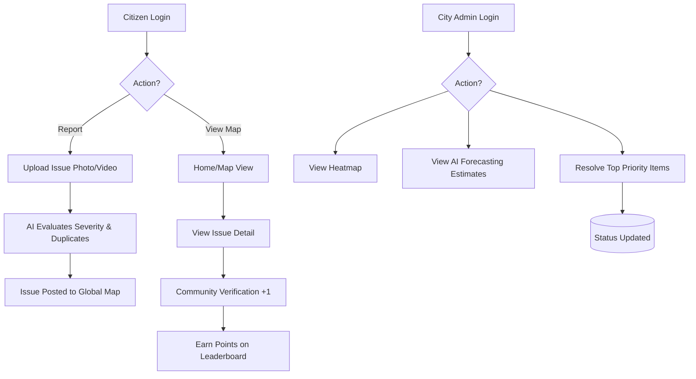

<div align="center">
  
  
  
  
</div>

<div align="center">
  <h1>Civic Pulse</h1>
  <p><strong>Agentic AI-powered civic issue reporting and intelligent city administration</strong></p>
</div>

---

## Overview

Cities struggle with civic issue management—potholes, water leaks, and infrastructure damage are often reported in duplicate, lack standard severity assessments, and overwhelm city administrators with noise. 

**Civic Pulse** solves this by putting an autonomous, multi-agent AI system between citizens and city administration. When a user snaps a photo of an issue, AI perception models extract context (category, severity, reasoning). Geohash-backed AI deduplication algorithms prevent noise, and a predictive admin dashboard forecasts city infrastructure risks over 14 days based on recent patterns.

---

## Features

- [x] **Agentic AI Perception**: Upload a photo; Gemini 2.5 Flash automatically classifies the category, writes a title/description, and scores severity (1-10) with reasoning.
- [x] **Smart AI Deduplication**: Prevents duplicate reports by cross-referencing new reports against open issues within a 100m radius using semantic similarity. Automatically escalates severity if the new image shows deterioration.
- [x] **Multi-Agent Traceability log**: Fully transparent trace engine where users and admins can see the reasoning of the Perception, Deduplication, Severity, and Orchestrator agents.
- [x] **Geospatial Issue Mapping**: Real-time interactive map (powered by Leaflet & Geofire) showing localized issues, colored by severity and status.
- [x] **Admin Predictive Insights Dash**: AI autonomously generates 14-day forecasts for city wards (e.g., "Waterlogging complaints predicted to rise 40%").
- [x] **Priority Queuing & Heatmaps**: Admin view features dynamic resolution tracking, risk scoring, and a geospatial heatmap of critical issues.
- [x] **Community Verification Engine**: Citizens can visually confirm nearby issues (+1) to build community trust scores and crowd-source validation.
- [x] **Gamified Leaderboard**: Users earn points for reporting accurately and verifying community issues.

---

## Demo

- **Live Application**: [[DEPLOYMENT_URL_HERE](https://civic-pulse-1066023390088.asia-southeast1.run.app)]

## Architecture

[INSERT ARCHITECTURE DIAGRAM]

```mermaid
graph TD
    Client[React/Vite Frontend] --> Auth[Firebase Authentication]
    Client --> Storage[Cloudinary Image Storage]
    Client --> DB[(Firebase Firestore)]
    
    subgraph Google SDK
    AI[Google Gen AI SDK / Gemini 2.5]
    end
    
    Client --> AI
    DB -. Realtime Streams .-> Client
    
    subgraph Core Features
    Map[Leaflet Geospatial Engine]
    Geo[Geofire-common Distance Math]
    Chart[Recharts Data Viz]
    end
    
    Client --> Map
    Client --> Geo
    Client --> Chart
````
```mermaid
sequenceDiagram
    participant User
    participant Frontend
    participant Perception Agent
    participant Deduplication Agent
    participant Orchestrator
    participant DB

    User->>Frontend: Upload Image & Location
    Frontend->>Perception Agent: Analyze Image (Gemini Flash)
    Perception Agent-->>Frontend: Returns Category, Severity (1-10), Reasoning
    Frontend->>Deduplication Agent: Geohash lookup (100m radius)
    Deduplication Agent->>DB: Fetch open issues nearby
    Deduplication Agent->>Deduplication Agent: Semantic similarity check (Gemini)
    Deduplication Agent-->>Orchestrator: Duplicate boolean & similarity
    
    alt Is Duplicate
        Orchestrator->>Orchestrator: Calculate severity escalation
        Orchestrator->>DB: Merge & update existing report (Trace Logged)
    else Is Unique
        Orchestrator->>DB: Create new report (Trace Logged)
    end
```

## Tech Stack

| Layer              | Technology                                           |
| ------------------ | ---------------------------------------------------- |
| Frontend           | React 19, TypeScript, Vite                           |
| Styling            | Tailwind CSS v4, Framer Motion, Lucide Icons         |
| Geospatial         | Leaflet, React-Leaflet, Leaflet.Heat, Geofire-common |
| Data Visualization | Recharts                                             |
| Backend & Database | Firebase Firestore (Realtime NoSQL)                  |
| Authentication     | Firebase Authentication (Google Provider)            |
| AI Models          | Google Gemini 2.5 Flash (`@google/genai` SDK)        |
| Blob Storage       | Cloudinary                                           |
## Google Technologies Used

Civic Pulse is built on Google's AI and cloud ecosystem to deliver an intelligent, scalable, and real-time civic issue management platform.

| Technology                                     | Purpose                                                                                                                                      |
| ---------------------------------------------- | -------------------------------------------------------------------------------------------------------------------------------------------- |
| **Google AI Studio**                           | Core development and deployment platform used for building, testing, and deploying the application.                                          |
| **Gemini 2.5 Flash**                           | Powers AI-driven image analysis, issue categorization, severity assessment, structured data extraction, and intelligent reasoning workflows. |
| **Firebase Firestore**                         | Serves as the real-time NoSQL database for storing civic reports, user data, verification records, agent traces, and analytics.              |
| **Firebase Authentication**                    | Provides secure Google Sign-In authentication for citizens and administrators.                                                               |
| **Firebase Hosting / Google Cloud Deployment** | Used for application deployment and public accessibility.                                                                                    |
| **Google Maps Platform** *(if implemented)*    | Enables location-based issue reporting, mapping, and geospatial visualization.                                                               |

## Agentic AI Capabilities
Civic Pulse does not treat AI as a mere chatbot; it orchestrates a specialized intelligence pipeline.

### Perception Agent
Extracts structured attributes, title tags, and a localized severity rating directly from an uploaded image using Gemini 2.5 Flash.

### Deduplication Agent
Prevents database bloating by calculating spatial bounds using the user's geohash, querying Firestore for reports within a 100-meter radius, and evaluating semantic similarity to automatically merge duplicate reports or escalate severity when necessary.

### Forecasting Agent
Continuously analyzes ward-level data within the administrative dashboard and generates predictive insights, identifying whether civic issues such as potholes, garbage accumulation, or water leakages are expected to increase or decrease over the next 14 days based on recent reporting patterns.

## License
This project is free software and available under the **GNU General Public License v3.0** (GPL-3.0). See the [LICENSE](LICENSE) file for more details.
